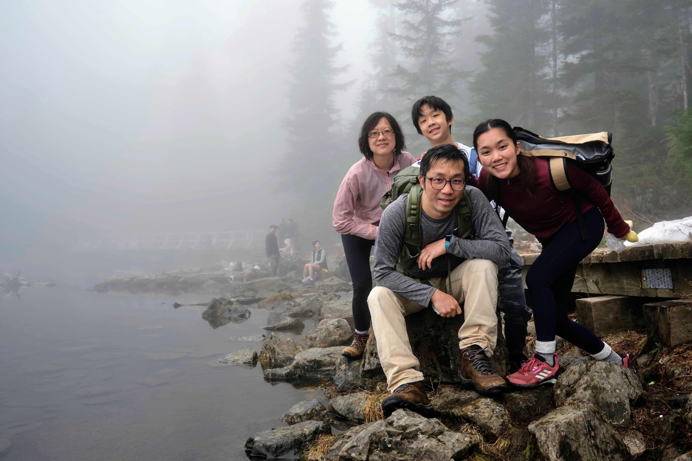
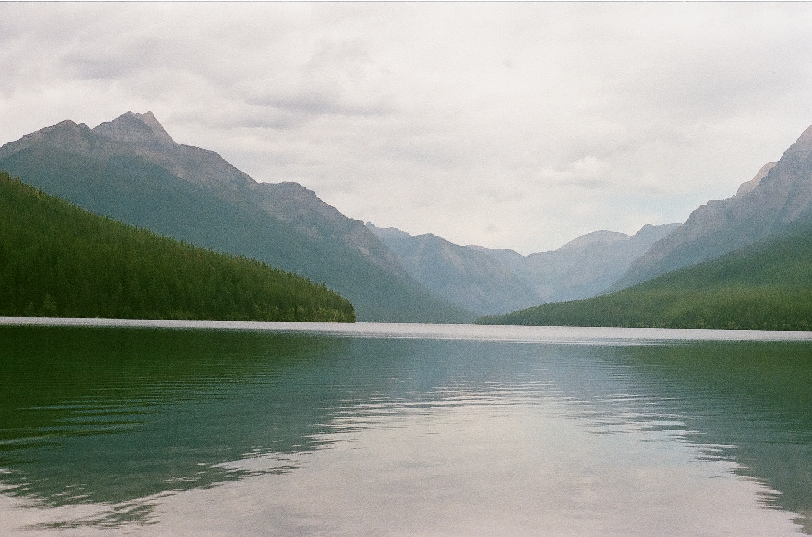

## Hi! My name is [Mia Chen](README.md).
### I'm a *2nd-year CS major* in **Sixth College**. 

My hobbies include `surfing`, `hiking`, `running` - anything [outdoorsy](#national-parks) really, taking pictures, [travel](#other-travles). 
> *“Nature gives to every time and season some beauties of its own.” –Charles Dickens*

## National Parks

My family and I go to a lot of national parks. Here is a list of some that I have been to - and my top 3:

1. [Glacier National Park](https://www.nps.gov/glac/index.htm)
2. [Banff National Park] (https://en.wikipedia.org/wiki/Banff_National_Park)
3. Bryce Canyon National Park
- Yellowstone National Park
- Mt Rainier National Park
- Olympic National Park

## Other Travels
I have an extensive bucket list. Here are a few:
- [ ] Swim with humpback whales in Tonga
- [ ] Hike the Dolomites
- [ ] See the northern lights
- [x] Watch the sunrise at Moraine Lake
